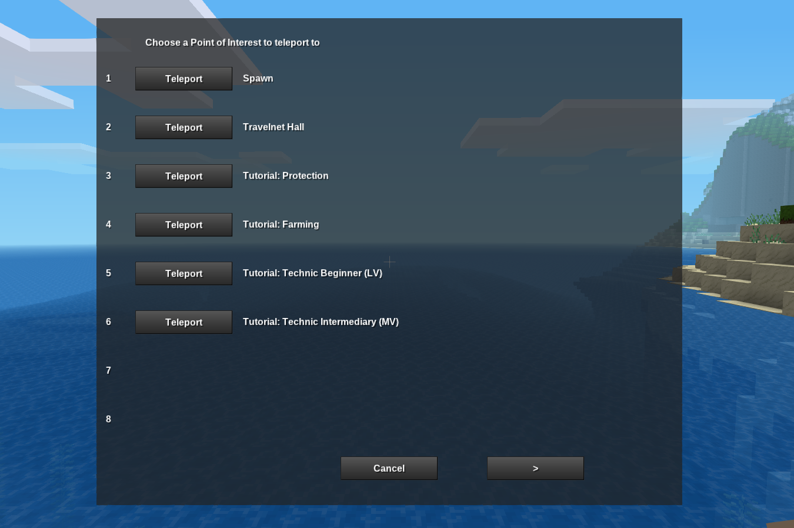

# Minetest mod: Points Of Interest
Author: Zenon Seth

Points of Interest (poi) is a mod that allows server admins to add points of interest and description of each point to a global list from which all player can teleport to. 

This can be used to add points to visit for specific tutorials, builds or travelnet hubs.

## Configuration

By default, there's a total of 64 points of interest that can be set. This number can be modified by editing `MAX_POIS` at the top of the mod's `init.lua`. It's required that this number is a multiple of 8 (since 8 points are shown per page) - if it's not, there's no guarantee the mod won't break.

## Privs
- `manage_pois` : required to set/move/edit points of interest

## Chat commands
- `/points_of_interest` : Shows a list of points, split into pages, that the user can teleport to if any of those points are set. Requires no privs.
- `/pois` : Shorthand for the `points_of_interest` command
- `/setpoi <index> <multiword description>` : Takes the current coordinates of the user and sets them as the teleport location for the given index. The given description will be shown to users who view the points of interest. Requires `manage_pois` priv. 
- `/rmpoi <index>` : Removes the point of interest at the specified index. Requires `manage_pois` priv.
- `/swappoi <index1> <index2>` : Swaps the order of the two points of interest at the given indecies. If either is empty, then it effectively moves the non-empty one to the new position. Requires `manage_pois` priv.
- `/editpoi <index> <new multiword description>` : Changes the text for the specified index that is shown to users when they view the list of points of interests. No effect is the point is not set at that index.

## Uninstallation
Nothing special is required to uninstall the mod - simply remove it from your server. 

You may optionally also delete the file called `points_of_interest.txt` under your world's folder, where the points of interest are stored.

## Screenshot

## Support
Submit feedback and bugs on github: https://github.com/ZenonSeth/points_of_interest